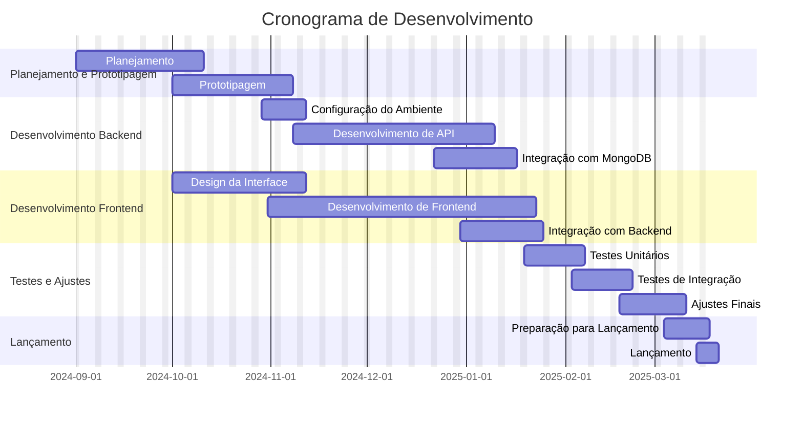
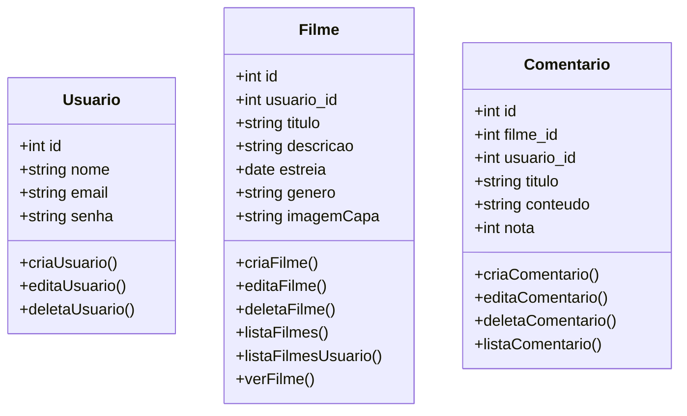
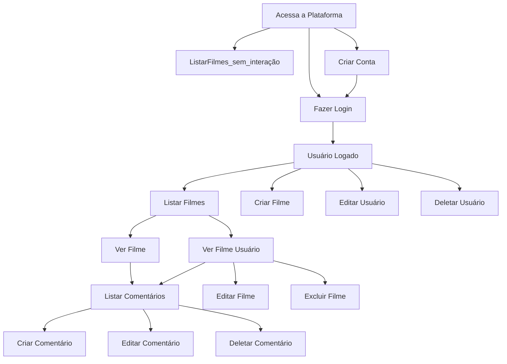
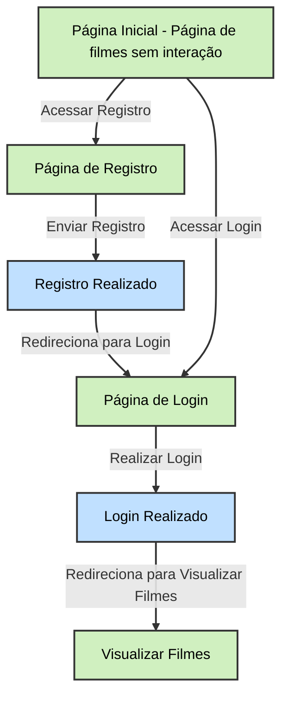
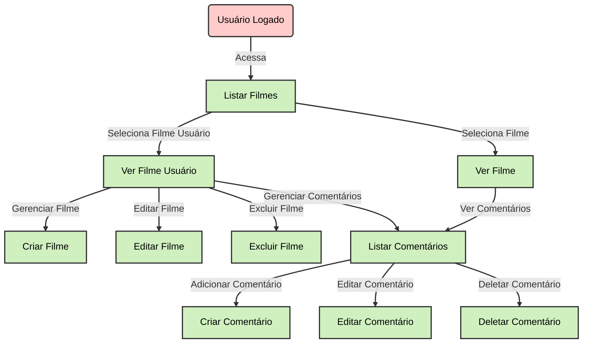
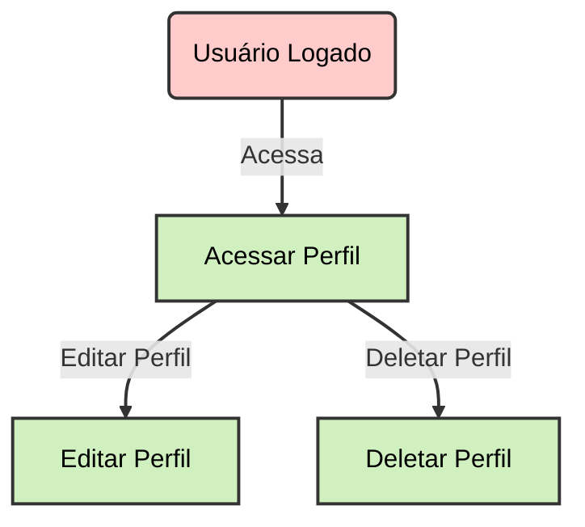

# Somativa Node.js - React - MongoDB
## PLATAFORMA DE GERENCIAMENTO DE EVENTOS

---

# Contexto
Uma empresa de cinema precisa de uma plataforma para gerenciar seu catálogo de filmes. A principal função do sistema será permitir que os administradores da empresa realizem operações de CRUD (Criar, Ler, Atualizar e Deletar) nos filmes e listem as avaliações feitas pelos espectadores, fornecendo uma visão geral sobre a popularidade dos filmes com base nas avaliações recebidas.

---

# Escopo
## Objetivos
### Específicos:
- Desenvolver uma interface administrativa onde os administradores possam adicionar, editar e remover filmes.
- Implementar uma funcionalidade para listar e visualizar filmes com suas avaliações e comentários.
- Criar um sistema de avaliação onde os espectadores possam classificar e comentar sobre os filmes.

### Mensuráveis:
- O sistema deve permitir a criação, leitura, atualização e exclusão de pelo menos 50 filmes.
- A interface deve listar filmes e avaliações com capacidade de filtrar por gênero, data e popularidade.
- As avaliações devem ser capturadas e exibidas com um sistema de média de notas e comentários.

### Atingíveis:
- Utilizar Node.js para o backend e MongoDB para o banco de dados, garantindo a escalabilidade e flexibilidade do sistema.
- Desenvolver a interface com React para uma experiência de usuário interativa e responsiva.
- Garantir que as funcionalidades sejam implementadas usando práticas de desenvolvimento ágeis e testes contínuos para assegurar a qualidade do sistema.

### Relevantes:
- A plataforma vai atender a uma necessidade crítica da empresa de cinema, permitindo a gestão eficiente dos filmes e análises detalhadas das avaliações dos espectadores.
- Melhoria na gestão do catálogo de filmes e na análise de popularidade ajudará a empresa a tomar decisões mais informadas sobre quais filmes promover e quais ajustar ou retirar.

### Temporais:
- Desenvolver e implementar a plataforma em um prazo de 6 meses.
- Completar a fase de planejamento e prototipagem em 1 mês.
- Finalizar o desenvolvimento do backend e do banco de dados em 2 meses.
- Concluir o desenvolvimento da interface e a integração com o backend em 2 meses.
- Realizar testes, ajustes e preparar o lançamento em 1 mês.

## Análise de Riscos

### Problemas com Disponibilização de Conteúdos:
- **Risco:** Dificuldades no upload e gerenciamento de arquivos de filmes e avaliações.
- **Mitigação:** Implementar validações e testes rigorosos para o upload e gerenciamento de arquivos. Fornecer suporte técnico e instruções claras aos administradores e usuários finais.

### Desafios na Implementação da Interface de Usuário:
- **Risco:** Interface pouco intuitiva e difícil de usar para administradores e espectadores.
- **Mitigação:** Realizar testes de usabilidade com administradores e usuários finais. Ajustar o design e a funcionalidade com base no feedback recebido para garantir uma experiência de usuário intuitiva.

### Segurança de Dados e Controle de Acesso:
- **Risco:** Acesso não autorizado e vazamento de dados dos usuários e dos filmes.
- **Mitigação:** Implementar criptografia para dados sensíveis e controle rigoroso de permissões de acesso. Realizar auditorias de segurança regulares e manter atualizações de segurança em dia.

### Problemas de Performance e Escalabilidade:
- **Risco:** A plataforma pode enfrentar problemas de desempenho e não suportar um grande número de usuários simultâneos.
- **Mitigação:** Realizar testes de carga para identificar e resolver problemas de desempenho. Otimizar consultas ao banco de dados e planejar soluções de escalabilidade, como balanceamento de carga e otimização de caching.

## Recursos:
### Humanos:
- **Desenvolvedores Backend:** Especialistas em Node.js para implementar a lógica do servidor e integração com MongoDB.
- **Desenvolvedores Frontend:** Especialistas em React para criar a interface do usuário interativa e responsiva.
- **Designer de UI/UX:** Para garantir uma experiência de usuário intuitiva e agradável.
- **Administrador de Banco de Dados:** Para configurar e gerenciar o MongoDB.
- **Analista de Qualidade/Testes:** Para garantir a funcionalidade e a qualidade do sistema através de testes rigorosos.

### Tecnológicos:
- **Ambiente de Desenvolvimento:** Ferramentas de desenvolvimento como editores de código, IDEs (por exemplo, Visual Studio Code), e softwares de controle de versão (por exemplo, Git).
- **Servidores de Teste e Produção:** Infraestrutura para hospedar a aplicação e o banco de dados, que pode incluir servidores locais ou soluções em nuvem.
- **Documentação e Ferramentas de Gerenciamento de Projetos:** Software para documentação e gerenciamento de projetos (por exemplo, Jira, Confluence) para garantir a organização e o acompanhamento das tarefas e progresso do projeto.

## Cronograma:

## Diagramas:
### Classe:

### Uso:

### Fluxo:
#### Usuário não logado

#### Usuário Logado Gerenciando Filmes e Comentários:

#### Usuário Logado Gerenciando Perfil

## Protótipos:
### Baixa fidelidade:

  

### Média fidelidade:

  

### Alta fidelidade:

  

# Manual de testes e desenvolvimento:
## Executar a aplicação:
É necessário executar o BackEnd e FrontEnd separadamente, para isso, siga os seguintes passos:
1. BackEnd:
> Abra um primeiro terminal na pasta "`server`" (Na pasta raíz, `cd .\server\`);
> Execute o comando `node .\server.js`;
2. Frontend:
> Abra um segundo terminal na pasta "`appraiser` (Na pasta raíz, `cd .\appraiser\`);
> Execute o comando `npm run dev`;
3. Acessar o localhost:5173, porta onde a aplicação já está rodando!